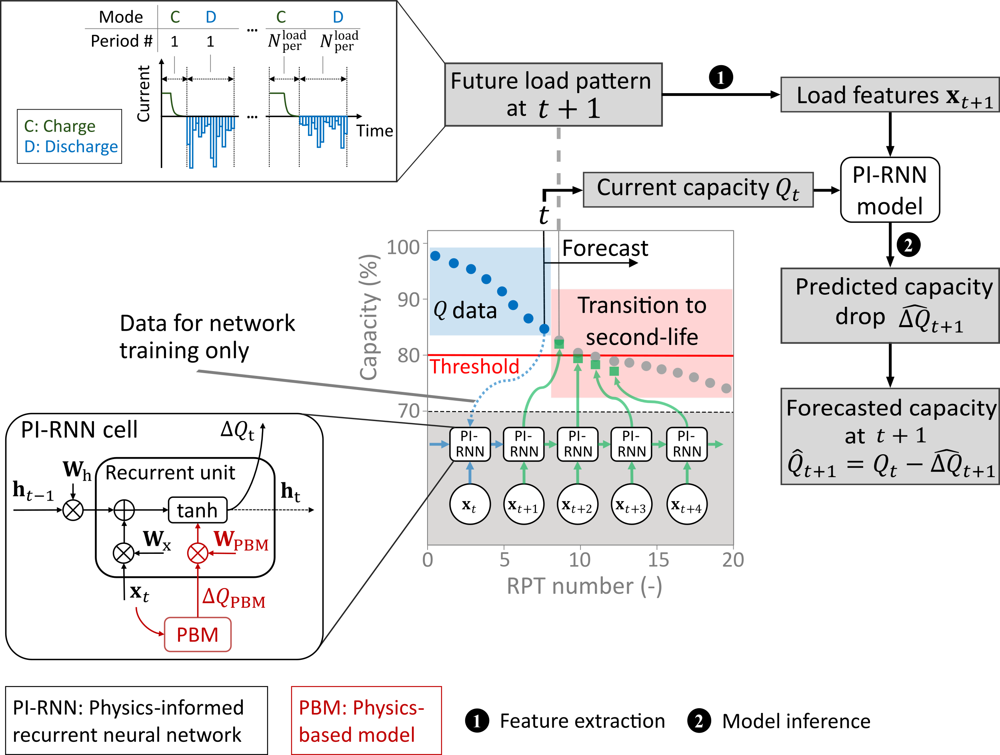

# Forecasting Battery Capacity for Second-Life Applications Using Physics-Informed Recurrent Neural Networks

This repository accompanies our published paper  
> **“Forecasting Battery Capacity for Second-Life Applications Using Physics-Informed Recurrent Neural Networks”** *(https://doi.org/10.1016/j.etran.2025.100432)*  

It contains code and processed data for training, evaluating, and visualizing a physics-informed recurrent neural network (PI-RNN) alongside several baselines to forecast battery capacity fade in first- and second-life phases. The raw data is available at: *(placeholder link to raw data)*



---

## 🚀 Project Structure

```
.
├── processed_data/               # Preprocessed Cycling & RPT datasets
│   ├── Batch1.pkl                # Processed data from Batch 1
│   └── Batch2.pkl                # Processed data from Batch 2
│                                 # (original filenames: Processed_data_Cycling&RPT_Batch1/2_Capacity_Forecasting_merged_update_Jan2025.pkl)
├── saved_models/                 # Trained model weights
│   ├── b3_scenario3.pth          # Baseline RNN trained on scenario 3
│   ├── pi_rnn_scenario3.pth      # PI-RNN trained on scenario 3
│   └── pi_rnn_s3_mc_dropout.pth  # PI-RNN with MC dropout for uncertainty quantification
├── simulated_PBM_data/           # Physics-based simulations & extracted features (top-performing groups in test set)
│   ├── G2_PBM_Simulated.pkl
│   ├── G3_PBM_Simulated.pkl
│   ├── G4_PBM_Simulated.pkl
│   ├── G16_PBM_Simulated.pkl
│   └── G18_PBM_Simulated.pkl
├── data_utils.py                 # Data loaders and input sequence builders
├── models.py                     # PI-RNN, baseline RNNs, and PBM surrogate models
├── pbm_experiments.py            # PyBaMM-based simulation and feature extraction
├── preprocessing.py              # Raw Excel → merged .pkl conversion + capacity fade plotting
├── RMSE_evaluation.py            # RMSE & MAE computation for single/multi-step forecasts
├── training_strategies.py        # Scenario-based training pipelines for PI-RNN and baselines
├── trajectory_forecast.py        # CLI-based visualization of capacity trajectory forecasts
├── uncertainty_quantification.py # UQ: prediction intervals + calibration curve evaluation
└── requirements.txt              # Required Python dependencies

```

---

## 📄 Script Overviews

- **data_utils.py**  
  - Centralizes dataset paths and feature/target definitions  
  - `load_pbm_surrogate()`, `load_batch()`, `load_battery_data()`, `make_sequences()`

- **models.py**  
  - `train_pbm_surrogate_for_PI_RNN()` — PBM surrogate for capacity-drop injection (random forest)  
  - `CustomRNNCellWithSurrogate` & `MultiStepPIRNN` — physics-informed RNN  
  - `BaselineMultiStepRNN` — standard RNN baseline  
  - `GPRBaseline` — model-based Gaussian process baseline  
  - `PBMSurrogate` — PBM surrogate model class  

- **pbm_experiments.py**  
  - Defines PyBaMM experiments for each group  
  - Runs cycling/RPT, extracts features, saves to `simulated_PBM_data/`

- **preprocessing.py**  
  - Parses “Cycling n” Excel files, computes throughput/time duration features  
  - Reads RPT capacities from master Excel, merges, saves to `processed_data/`  
  - Plots capacity fade per group 

- **RMSE_evaluation.py**  
  - Trains PI-RNN, Baseline RNN, GPR, PBM surrogate   
  - Computes and plots single-step and multi-step RMSE/MAE comparisons

- **training_strategies.py**  
  - Implements three forecasting scenarios (S1: fixed horizon, S2: recursive, S3: maximum horizon)  
  - Trains and saves PI-RNN and Baseline RNN for each scenario  
  - Provides visualization 

- **trajectory_forecast.py**  
  - CLI to load pretrained S3 models (PI-RNN & Baseline)  
  - (Optional) fine-tuning on first N points of a selected cell  
  - Combines RNN & GPR forecasts, plots trajectories & RMSE bars

- **uncertainty_quantification.py**  
  - Loads or trains the S3 PI-RNN model with MC dropout, saves model state  
  - Generates convex-combined prediction of original and recalibrated intervals across life phases  
  - Fits isotonic recalibration on “C2” cells (held-out calibration set), plots calibration curves for different number of mc dropout samples

---

## 🔧 Installation

1. **Clone**  
   ```bash
   git clone https://github.com/your-org/PI-RNN-for-Capacity-Forecasting.git
   cd PI-RNN-for-Capacity-Forecasting
   ```

2. **Create & activate** your Python environment  
   ```bash
   python3 -m venv venv
   source venv/bin/activate
   ```

3. **Install dependencies**  
   ```bash
   pip install -r requirements.txt
   ```

---

## ▶️ Usage Examples

1. **Preprocess data & plot capacity fade**  
   ```bash
   python preprocessing.py
   ```

2. **Generate PBM-simulated features**  
   ```bash
   python pbm_experiments.py
   ```

3. **Train & evaluate RMSE/MAE**  
   ```bash
   python RMSE_evaluation.py
   ```

4. **Train forecasting scenarios**  
   ```bash
   python training_strategies.py
   ```

5. **Interactive trajectory forecast**  
   ```bash
   python trajectory_forecast.py --group G13 --cell C1
   ```

6. **Uncertainty quantification & calibration curves**  
   ```bash
   python uncertainty_quantification.py
   ```

---

## 📋 Requirements

See `requirements.txt` for full dependency list.

---

## 📖 Citation

Please cite our paper if you use this code:

```bibtex
@article{navidi2025forecasting,
  title={Forecasting battery capacity for second-life applications using physics-informed recurrent neural networks},
  author={Navidi, Sina and Bajarunas, Kristupas and Chao, Manuel Arias and Hu, Chao},
  journal={eTransportation},
  pages={100432},
  year={2025},
  publisher={Elsevier}
}
```
